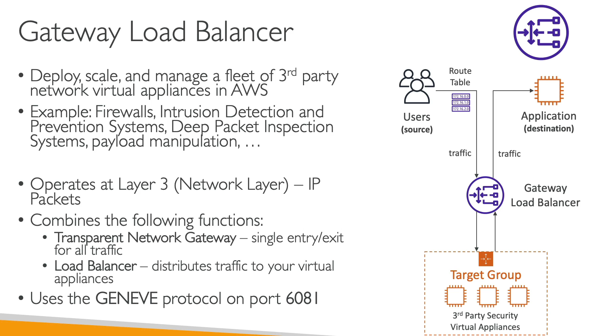
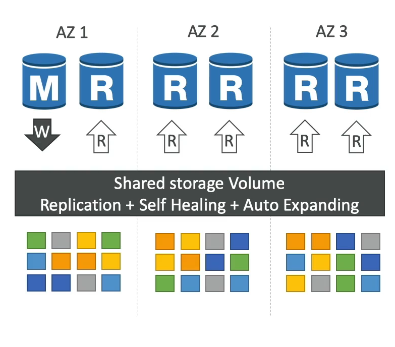
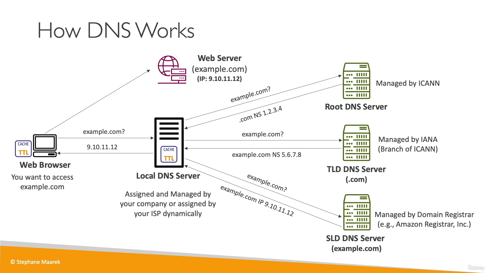
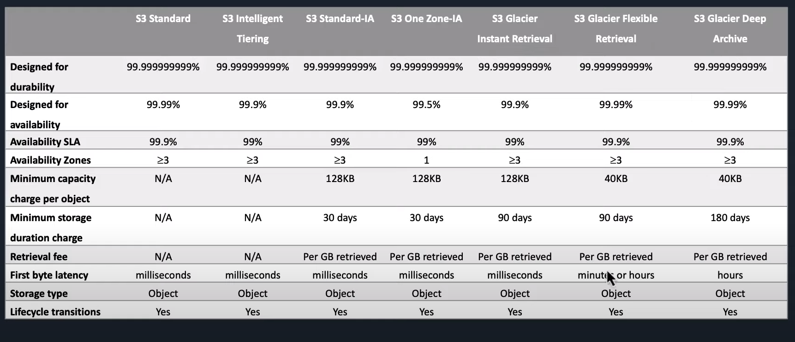

## IAM

* By default, a explicty deny, always overrides explicit allow.
* IAM policy can only be attached to user and groups, it can't be attached to things like EC2, S3.
* By default, an IAM user has non explicty deny for all AWS services.
* Never store API keys on EC2 instance.
* IAM users with even admin access don't have access to billing details. To enable billing details for IAM user, enable "IAM user and role access to Billing information" setting in root user Accounting section.
* 

---------------------------

### IAM Roles

* Only one role can be attached to EC2 instance at a time.
* Roles don't have API credentials (only users can have them).

---------------------------

### VPC

* VPC spans multiple AZs but housed within a single region - This allows you to provision redundant resources in separate AZs while having them accessible on the same network.
* You can only have 5 VPCs per region
* Subnets resides in one AZ.

---------------------------

### NACLs

* NACLs are associated with subnets in a VPC and spans Availability Zone.
* NACLs are stateless, means you need to explicitly specify inbound and outbound rules.
* Rules are evaluated in order, starting with the lowest rule number. If traffic is denied at the lower rule no. and allowed at the higher rule no. the allow rule will be ignored and traffic will be denied.
* Subnet can be associated with only one NACL at a time.

---------------------------

### Security Groups

* It is applicable to instances only. 
* It can be attached to multiple instances.
* All rules are evaluated before deciding  to allow traffic.

---------------------------

### ENI

* An instance can connect to multiple subnets using Elastic Network Interfaces (ENIs).
* Elastic Network Interfaces (ENIs) are bounded to a specific AZ. You can not attach an ENI to an EC2 instance in a different AZ.

---------------------------

### EC2

* public ip address only changes when you stop and start the server. If you don't want this then use elastic IP (but a better approach would be to use route 53).

---------------------------

### EC2 Hibernate
We know we can stop, terminate instances
* Stop - the data on disk (EBS) is kept intact in the next start
* Terminate – any EBS volumes (root) also set-up to be destroyed is lost

---------------------------

### EBS

* EBS is bound to a specific AZ.
* By default, the Root volume type will be deleted as its "Delete On Termination" attribute checked by default. Any other EBS volume types will not be deleted as its "Delete On Termination" attribute disabled by default.
* When creating EC2 instances, you can only use the following EBS volume types as boot volumes: gp2, gp3, io1, io2, and Magnetic (Standard).
* To encrypt an unencrypted EBS you need to creat a snapshot first.
* It is network drive not phsically attached to EC2.

### EBS - Multi Attach

• Attach the same EBS volume to multiple EC2 instances in the same AZ
• Each instance has full read & write permissions to the high-performance volume
• Use case: Achieve higher application availability in clustered Linux applications (ex: Teradata)
• Applications must manage concurrent write operations
• Up to 16 EC2 Instances at a time
• Must use a file system that's cluster-aware (not XFS, EXT4, etc...)

### EFS

* EFS is a network file system (NFS) that allows you to mount the same file system on EC2 instances that are in different AZs.

### Instance Store

* EBS volumes are network drives with good but "limited" performance
* If you need a high-performance hardware disk, use EC2 Instance Store

* Better I/O performance
* EC2 Instance Store lose their storage if they're stopped (ephemeral)
* Good for buffer/cache/scratch data / temporary content
* Risk of data loss if hardware fails
* Backups and Replication are your responsibility

---------------------------

### AMI 

* AMI = Amazon Machine Image
* AMI are a customization of an EC2 instance
    * You add your own software, configuration, operating system, monitoring...
    * Faster boot / configuration time because all your software is pre-packaged
*  AMI are built for a specific region (and can be copied across regions)
* You can launch EC2 instances from:
    * A Public AMI: AWS provided.
    * Your own AMI: you make and maintain them yourself
    * An AWS Marketplace AMI: an AMI someone else made (and potentially sells)
* AMIs are built for a specific AWS Region, they're unique for each AWS Region. You can't launch an EC2 instance using an AMI in another AWS Region, but you can copy the AMI to the target AWS Region and then use it to create your EC2 instances.    

    
---------------------------

### Load Balancer

There are 4 types of load balancers:

1. Application load balancer
1. Network load balancer
1. Gateway load balancer
1. Classic load balancer (deprecated)

* When using an Application Load Balancer to distribute traffic to your EC2 instances, the IP address you'll receive 
requests from will be the ALB's private IP addresses. To get the client's IP address, ALB adds an additional header 
called "X-Forwarded-For" contains the client's IP address.

* When you enable ELB Health Checks, your ELB won't send traffic to unhealthy (crashed) EC2 instances.

* ALBs can route traffic to different Target Groups based on URL Path, Hostname, HTTP Headers, and Query Strings.

* The following cookie names are reserved by the ELB (AWSALB, AWSALBAPP, AWSALBTG).

* When Cross-Zone Load Balancing is enabled, ELB distributes traffic evenly across all registered EC2 instances in 
all AZs.

* Server Name Indication (SNI) Application Load Balancers and Network Load Balancers allows you to load multiple SSL certificates on one listener.

* The Auto Scaling Group can't go over the maximum capacity (you configured) during scale-out events.

#### Application load balancer

* Application Load Balancers support HTTP, HTTPS and WebSocket

#### Network load balancer

* Network Load Balancer provides the highest performance and lowest latency if your application needs it.

Network Load Balancer has one static IP address per AZ and you can attach an Elastic IP address to it. Application 
Load Balancers and Classic Load Balancers have a static DNS name.

#### Gateway Load Balancer

---------------------------

### RDS

Advantage over using RDS versus deploying Amazon RDS Overview DB on EC2
* RDS is a managed service:
    * Automated provisioning, OS patching
    * Continuous backups and restore to specific timestamp (Point in Time Restore)!
    * Monitoring dashboards
    * Read replicas for improved read performance
    * Multi AZ setup for DR (Disaster Recovery)
    * Maintenance windows for upgrades
    * Scaling capability (vertical and horizontal)
    * Storage backed by EBS
* BUT you can't SSH into your instances

#### RDS - Storage Auto Scaling

* Helps you increase storage on your RDS DB instance dynamically
* When RDS detects you are running out of free database storage, it scales automatically
* Avoid manually scaling your database storage
* You have to set Maximum Storage Threshold (maximum limit for DB storage)
* Automatically modify storage if:
    * Free storage is less than 10% of allocated storage
    * Low-storage lasts at least 5 minutes
    * 6 hours have passed since last modification
* Useful for applications with unpredictable workloads
* Supports all RDS database engines
* Multi-AZ helps when you plan a disaster recovery for an entire AZ going down. If you plan against an entire AWS Region going down, you should use backups and replication across AWS Regions.

#### RDS Custom

* Managed Oracle and Microsoft SQL Server Database with OS and database customization
* RDS: Automates setup, operation, and scaling of database in AWS 
* Custom: access to the underlying database and OS so you can
* Configure settings
    * Install patches
    * Enable native features
    * Access the underlying EC2 Instance using SSH or SSM Session Manager
    * De-activate Automation Mode to perform your customization, better to take a DB snapshot before
* RDS vs. RDS Custom
    * RDS: entire database and the OS to be managed by AWS
    * RDS Custom: full admin access to the underlying OS and the database

#### Amazon Aurora

* Aurora is a proprietary technology from AWS (not open sourced)
* Postgres and MySQL are both supported as Aurora DB (that means your drivers will work as if Aurora was a Postgres 
or MySQL database)
* Aurora is "AWS cloud optimized" and claims 5x performance improvement over MySQL on RDS, over 3x the performance of 
Postgres on RDS
* Aurora storage automatically grows in increments of 10GB, up to 128 TB.
* Aurora can have up to 15 replicas and the replication process is faster than MySQL (sub 10 ms replica lag)
* Failover in Aurora is instantaneous. It's HA native.
* Aurora costs more than RDS (20% more) - but is more efficient.    

#### Aurora High Availability and Read Scaling

* 6 copies of your data across 3 AZ:
    * 4 copies out of 6 needed for writes
    * 3 copies out of 6 need for reads
    * Self healing with peer-to-peer replication
    * Storage is striped across 100s of volumes
* One Aurora Instance takes writes (master)
* Automated failover for master in less than 30 seconds
* Master + up to 15 Aurora Read Replicas serve reads
* Support for Cross Region Replication

#### Aurora DB Cluster

---------------------------

### Route 53

Types of records:
* A - used to point domain to an ipv4
* AAAA - used to point domain to an ipv6
* CNAME - used to point host/name to another host/name
* MX - used to route email

### Alias Record Set

Instead of pointing to an IP, an alias record set contains a pointer to an AWs specific resource, such as:
* elb
* cloudfront distribution
* elastic beanstalk
* s3 bucket (configured for static website)

### Routing Policy

* simple: route all traffic to one endpoint
* weighted: route all traffic to multiple endpoint
* latency: route traffic to endpoint based on the users latency to various endpoints
* failover:  route traffc to secondary endpoint of primary is offline
* geo-location: route traffic to endpoint based on the geographical location of the user.

#### How DNS works

### S3

#### S3 Storage class

