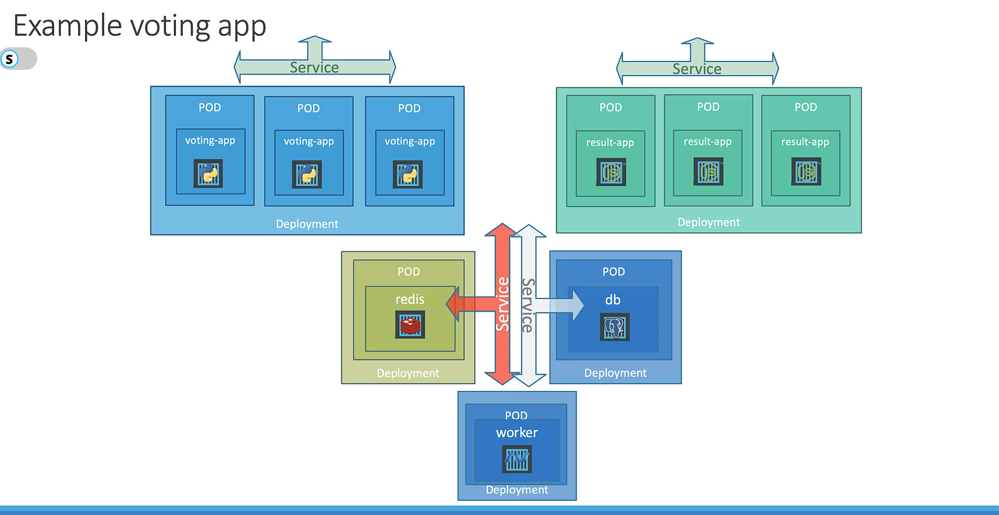

## Get the nodes that are part of the cluster

```bash
kubectl get nodes
```

## Get the k8s version

```bash
$: kubectl version
Client Version: v1.30.0+k3s1
Kustomize Version: v5.0.4-0.20230601165947-6ce0bf390ce3
Server Version: v1.30.0+k3s1
```

## Get OS on which k8s is running

```bash
$: kubectl get nodes -o wide
NAME           STATUS   ROLES                  AGE     VERSION        INTERNAL-IP    EXTERNAL-IP   OS-IMAGE             KERNEL-VERSION   CONTAINER-RUNTIME
controlplane   Ready    control-plane,master   8m40s   v1.30.0+k3s1   192.10.229.9   <none>        Alpine Linux v3.16   5.4.0-1106-gcp   containerd://1.7.15-k3s1
```

## Start a pod

```bash
kubectl run nginx --image=nginx
```

Starting pod with label:

```bash
kubectl run nginx --image=nginx --labels="key1=val1,key2=val2"
```

## Check status of the pod in default namespace

```bash
kubectl get po
kubectl get po --watch
```

## Get details on the pod

```bash
kubectl describe po pod_name
```

## Get details on pod using `-o wide`

```bash
kubectl describe po pod_name -o wide
```

This displays `node` on which the pod is running.

## Delete a pod

```bash
kubectl delete po pod_name
```

## Delete all pods

```bash
kubectl delete po --all
```

## Editing a pod

```bash
kubectl edit po redis
```

## Creating resource file using `--dry-run`

```bash
kubectl run redis --image=redis --dry-run=client -o yaml > redis.yml
```

Option `--dry-run` can't be used with `kubectl describe`.

This will create a yaml config file that can be used to run the pod.

## Running a resource from file

```bash
kubectl create -f file_name.yml
```

## Running a resource file after update

```bash
kubectl apply -f file_name.yml
```

## Get all replicaset 

```bash
kubectl get rs
```

## Describe replicaset

```bash
kubectl describe rs replica_set_name
```

## Delete replicaset

```bash
kubectl delete rs replica_set_name
```

## Sample Re


## After updating the ReplicaSet resource, following commands can be used to apply the updated configuration:

```bash
kubectl replace -f file_name.yml

# the following two commands doesn't require to update the replica count in `yaml` file.

kubectl scale --replicas=6 -f file_name.yml 

kubectl scale --replicas=6 rs replica_name
```

## View all deployment, replicaset and pods

```bash
kubectl get all
```

## Create deployment imperatively

```bash
kubectl create deploy httpd-frontend --image=httpd:2.4-alpine --replicas=3
```


## View the status of the deployment

```bash
kubectl rollout status deploy deploy_name
```

## View rollout history

```bash
kubectl rollout history deploy deploy_name
```

## Undo rollout

```bash
kubectl rollout undo deploy deploy_name
```

## Record deployment

```bash
kubectl create -f deploy.yml --record # record change while creating
kubectl edit deploy deploy_name  --record  # record change while editing
```

##  Change image of existing deployment 

```bash
kubectl set image deploy deploy_name nginx=nginx:1.18-perl --record
kubectl edit deploy deploy_name --record
```

We can use any one of the above command.

## Defining service


```bash
# nodeport service
apiVersion: vl
kind: Service
metadata:
    name: myapp-service
spec:
    type: NodePort
    ports:
        -   targetPort: 80
            port: 80
            nodePort: 30008
    selector:
        app: myapp
        type: front-end
```

```bash
# ClusterIP service
apiVersion: vl
kind: Service
metadata:
    name: myapp-service
spec:
    type: ClusterIP
    ports:
        -   targetPort: 80
            port: 80
    selector:
        app: myapp
        type: front-end
```

## Get service url

```bash
minikube service service_name --url
```

## Simple Microservice Architecture




## k8s referencing services from other namespace


## Get all namespaces

```bash
kubectl get namespace 
kubectl get ns  # this is same
```

## Creating namespace

```bash
kubectl create namespace namespace_name
```

or we can create a resource file as follows:

```yaml
apiVersion: vl
kind: Namespace
metadata:
    name: dev
```

then run `kubectl create -f namespace.yaml`.

## Get resource from specific namespace

```bash
kubectl get po --namespace dev
kubectl get po -n dev  # this is same
```

## Switch namespace permanently

```bash
kubectl config set-context $(kubectl config current-context) --namespace=dev
```

## View resource from all namespace

```bas
kubectl get po --all-namespaces
kubectl get po -A
```

## Create a Service named redis-service of type ClusterIP to expose pod redis on port 6379

```bash
kubectl expose pod redis --port=6379 --name redis-service --dry-run=client -o yaml
```

This will automatically use the pod’s labels as selectors.

We can also create service using the following command:

```bash
kubectl create service clusterip redis --tcp=6379:6379 --dry-run=client -o yaml
```

This will not use the pods labels as selectors, instead it will assume selectors as app=redis. You cannot pass in selectors as an option. So it does not work very well if your pod has a different label set. So generate the file and modify the selectors before creating the service

## Create a Service named nginx of type NodePort to expose pod nginx’s port 80 on port 30080 on the nodes:

```bash
kubectl expose pod nginx --port=80 --name nginx-service --type=NodePort --dry-run=client -o yaml
```

This will automatically use the pod's labels as selectors, but you cannot specify the node port. You have to generate a definition file and then add the node port in manually before creating the service with the pod.

or

```bash
kubectl create service nodeport nginx --tcp=80:80 --node-port=30080 --dry-run=client -o yaml
```

Both the above commands have their own challenges. While one of it cannot accept a selector the other cannot accept a node port. I would recommend going with the `kubectl expose` command. If you need to specify a node port, generate a definition file using the same command and manually input the nodeport before creating the service.

## 


## A quick note on editing Pods and Deployments

Remember, you CANNOT edit specifications of an existing POD other than the below.

* spec.containers[*].image
* spec.initContainers[*].image
* spec.activeDeadlineSeconds
* spec.tolerations

For example, you cannot edit the environment variables, service accounts, and resource limits (all of which we will discuss later) of a running pod. But if you really want to, you have three options:

1. Run the kubectl edit pod command. This will open the pod specification in an editor (vi editor). Then, edit the required properties. When you try to save it, you will be denied. This is because you are attempting to edit a field on the pod that is not editable.

    

    

    A copy of the file with your changes is saved in a temporary location, as shown above.

    Now, run the following command:

    ```bash
    kubectl replace --force -f file.yaml
    ```

    This will delete the pod and recreate based on new changes.


1. You can then delete the existing pod by running the command:

    ```bash
    kubectl delete pod webapp
    ```

    Then, create a new pod with your changes using the temporary file:

    ```bash
    kubectl create -f /tmp/kubectl-edit-ccvrq.yaml
    ```

1. The second option is to extract the pod definition in YAML format to a file using the command:

    ```bash
    kubectl get pod webapp -o yaml > my-new-pod.yaml
    ```

    Then, make the changes to the exported file using an editor (vi editor). Save the changes:

    ```bash
    vi my-new-pod.yaml
    ```

    Then, delete the existing pod.

    ```bash
    kubectl delete pod webapp
    ```

    Then, create a new pod with the edited file.

    ```bash
    kubectl create -f my-new-pod.yaml
    ```

### Edit Deployments

With Deployments, you can easily edit any field/property of the POD template. Since the pod template is a child of the deployment specification, with every change, the deployment will automatically delete and create a new pod with the new changes. So, if you are asked to edit a property of a POD part of a deployment, you may do that simply by running the command.

```bash
kubectl edit deployment my-deployment    
```

## Get configmaps

```bash
kubectl get cm
```

## Describe configmaps

```bash
kubectl describe cm db-config
```

## Create configmaps imperative

```bash
kubectl create configmap\
app-config --from-literal=APP_COLOR=blue \
--from-literal=APP_MOD=prod
```

## Create configmaps from file

```bash
kubectl create configmap my-config --from-file=app-config.txt
```

## Create configmap declarative

```bash
apiVersion: v1
kind: ConfigMap
metadata:
    name: app-config
spec:
    APP_COLOR: blue
    APP_MODE: prod
```

then run the following command:

```bash
kubectl create -f file.yaml
```

## Create secret (imperative)

```bash
kubectl create secret generic my-secret \
  --from-literal=username=admin \
  --from-literal=password=secretpassword
```

## Create secret from file

```bash
kubectl create secret generic my-secret \
  --from-file=file.yaml
```

## Create secret using yaml (declarative)

```yaml
apiVersion: v1
kind: Secret
metadata:
  name: app-secret
data:
  username: dXNlcg== # base64 encoded value of 'user'
  password: cGFzc3dvcmQ= # base64 encoded value of 'password'
```

Here is how we can use this file in pod:

```yaml
apiVersion: vl
kind: Pod
metadata:
    name: simple-webapp-color
    labels:
        name: simple-webapp-color
spec:
    containers:
    -   name: simple-webapp-color
        image: simple-webapp-color
        ports:
        -   containerPort: 8080
        envFrom:
        - secretRef:
                name: app-secret
```

Here is how we can inject secret as single environment variable in pod:

```yaml
apiVersion: vl
kind: Pod
metadata:
    name: simple-webapp-color
    labels:
        name: simple-webapp-color
spec:
    containers:
    -   name: simple-webapp-color
        image: simple-webapp-color
        ports:
        -   containerPort: 8080
        env:
        -   name: password
            valueFrom:
                secretKeyRef:
                    name: app-secret
                    value: password
```

## encoding to base64

```bash
echo -n 'user' | base64
```

## decoding from base64

```bash
echo -n 'user' | base64 -d
```

## Get secrets

```bash
kubectl get secrets
```

## Describe secrets

```bash
kubectl describe secrets secret_name
```

Describing a secret won't print the encoded data. To view the encoded data:

```bash
kubectl get secrets secret_name -o yaml
```

## SecurityContext and capabilities

```bash
apiVersion: v1
kind: Pod
metadata:
  name: secure-pod
spec:
  containers:
    - name: secure-container
      image: nginx
      securityContext:
        runAsUser: 1000  # The container runs as user ID 1000
        capabilities:
          add:
            - NET_ADMIN    # Grants network administration caspabilities
            - SYS_TIME     # Grants ability to set system time
          drop:
            - ALL          # Drops all other capabilities not explicitly added
        allowPrivilegeEscalation: false  # Prevents privilege escalation
```

## Execute command inside container

```bash
kubectl exec ubuntu-sleeper -- whoami
```

This will execute `whoami` in the container in the `ubuntu-sleeper` pod.

If pod has multiple containers then we need to specify container as follows:

```bash
kubectl exec ubuntu-sleeper -c container1 -- whoami
```

## Create service account

```bash
kubectl create serviceaccount dashboard-sa
kubectl create sa dashboard-sa
```

## Get all nodes

```bash
kubectl get no
```

## Create taint

```bash
kubectl taint nodes node01 spray=mortein:NoSchedule
```

## Untaint a node

```bash
kubectl taint nodes controlplane node-role.kubernetes.io/control-plane:NoSchedule-
```


## Add label to node

```bash
kubectl label node node01 color=blue
```

## View logs from a specific pod

```bash
kubectl logs kibana -n elastic-stack 
```

## Readiness probe

Types of Readiness Probes:

1. HTTP Probe: Checks if an HTTP endpoint is responding.
1. TCP Probe: Checks if a TCP socket is open.
1. Exec Probe: Runs a command inside the container to check its readiness.

```bash
apiVersion: v1
kind: Pod
metadata:
  name: nginx-pod
spec:
  containers:
    - name: nginx
      image: nginx
      readinessProbe:
        httpGet:
          path: /
          port: 80
        initialDelaySeconds: 10  # Wait for 10 seconds before starting the probe
        periodSeconds: 5         # Check every 5 seconds
        timeoutSeconds: 1        # Probe times out after 1 second
        failureThreshold: 3      # If it fails 3 times, it’s considered not ready
        successThreshold: 1      # It needs 1 success to be considered ready
```

Similarly, `tcpSocket` and `exec` can be configured as follows:

```bash
 readinessProbe:
        tcpSocket:
            port: 3306
```

```bash
 readinessProbe:
        exec:
            command:
                - cat
                - /app/is_ready
```

## View live logs

```bash
kubectl logs -f pod_name
```

If pod has multiple container, then we need to specify the container name.

```bash
kubectl logs -f pod_name container_name
```

## View memory consumption

```bash
kubectl top node
```

```bash
kubectl top pod
```

## Specifying selector

```bash
kubectl get po --selector app=some_value
```

To specify multiple selector separate them with comma.

```bash
kubectl get all --selector env=prod,bu=finance,tier=frontend
```

## View jobs

```bash
kubectl get jobs
```

## Create a job

```bash
apiVersion: batch/v1
kind: Job
metadata:
    name: math-add-job
spec:
    template:
        spec:
            containers:
            -   name: math-add
                image: ubuntu
                command: ['expr', '3', '+' '2']
            restartPolicy: Never
```

## Create cron job

```bash
apiVersion: batch/v1
kind: CronJob
metadata:
  name: throw-dice-cron-job
spec:
  schedule: "30 21 * * *"
  jobTemplate:
    spec:
      completions: 3
      parallelism: 3
      backoffLimit: 25 # This is so the job does not quit before it succeeds.
      template:
        spec:
          containers:
          - name: throw-dice
            image: kodekloud/throw-dice
          restartPolicy: Never
```


##  Get network policies

```bash
kubectl get netpol
```

## Defining network policy

```bash
apiVersion: networking.k8s.io/v1
kind: NetworkPolicy
metadata:
  name: internal-policy
  namespace: default
spec:
  podSelector:
    matchLabels:
      name: internal
  policyTypes:
  - Egress
  - Ingress
  ingress:
    - {}
  egress:
  - to:
    - podSelector:
        matchLabels:
          name: mysql
    ports:
    - protocol: TCP
      port: 3306

  - to:
    - podSelector:
        matchLabels:
          name: payroll
    ports:
    - protocol: TCP
      port: 8080

  - ports:
    - port: 53
      protocol: UDP
    - port: 53
      protocol: TCP
```

## View ingress resource in all namespaces

```bash
k get ingress --all-namespaces
# or
k get ingress -A
```

## Create ingress resource

```bash
---
apiVersion: networking.k8s.io/v1
kind: Ingress
metadata:
  name: test-ingress
  namespace: critical-space
  annotations:
    nginx.ingress.kubernetes.io/rewrite-target: /
    nginx.ingress.kubernetes.io/ssl-redirect: "false"
spec:
  rules:
  - http:
      paths:
      - path: /pay
        pathType: Prefix
        backend:
          service:
           name: pay-service
           port:
            number: 8282
```

## Creating volume in pod

```bash
apiVersion: v1
kind: Pod
metadata:
  name: webapp
spec:
  containers:
  - name: event-simulator
    image: kodekloud/event-simulator
    env:
    - name: LOG_HANDLERS
      value: file
    volumeMounts:
    - mountPath: /log
      name: log-volume

  volumes:
  - name: log-volume
    hostPath:
      # directory location on host
      path: /var/log/webapp
      # this field is optional
      type: Directory
```

## Creating persistent volume

```bash
apiVersion: v1
kind: PersistentVolume
metadata:
  name: pv-log
spec:
  persistentVolumeReclaimPolicy: Retain
  accessModes:
    - ReadWriteMany
  capacity:
    storage: 100Mi
  hostPath:
    path: /pv/log
```

## Get persistent volumes

```bash
kubectl get pv
```

## Creating persistent volume claim

```bash
apiVersion: v1
kind: PersistentVolumeClaim
metadata:
  name: claim-log-1
spec:
  accessModes:
    - ReadWriteOnce
  resources:
    requests:
      storage: 50Mi
```

## Get persistent volumes claims

```bash
kubectl get pvc
```

## Using PVC in pod

````bash
apiVersion: v1
kind: Pod
metadata:
  name: mypod
spec:
  containers:
    - name: myfrontend
      image: nginx
      volumeMounts:
      - mountPath: "/var/www/html"
        name: mypd
  volumes:
    - name: mypd
      persistentVolumeClaim:
        claimName: myclaim
```