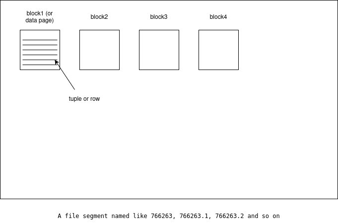

* A PostgreSQL cluster is a collection of several databases that all run under the very same Post-
greSQL service or instance.

* PostgreSQL ships with a specific tool called `pg_ctl`, which helps in managing the cluster and the
related running processes. This section introduces you to the basic usage of `pg_ctl` and to the
processes that you can encounter in a running cluster. It does not matter which service manage-
ment system your operating system is using, `pg_ctl` will always be available to the PostgreSQL
administrator in order to take control of a database instance.

* The `pg_ctl` command-line utility allows you to perform different actions on a cluster, mainly
initialize, start, restart, stop, and so on. pg_ctl accepts the command to execute as the first ar-
gument, followed by other specific arguments—the main commands are as follows:


    * `start`, `stop`, and `restart` execute the corresponding actions on the cluster.
    * `status` reports the current status (running or not) of the cluster.
    * `initdb` (or init for short) executes the initialization of the cluster, possibly removing
any previously existing data.
    * `reload` causes the PostgreSQL server to reload the configuration, which is useful when you want to apply configuration changes.
    * `promote` is used when the cluster is running as a replica server (namely a standby node) and, from now on, must be detached from the original primary becoming independent (replication will be explained in later chapters).

* Generally speaking, pg_ctl interacts mainly with the postmaster (the first process launched within
a cluster), which in turn “redirects” commands to other existing processes. For instance, when `pg_ctl` starts a server instance, it makes the postmaster process run, which in turn completes all the startup activities, including launching other utility processes (as briefly explained in the previous chapter). On the other hand, when pg_ctl stops a cluster, it issues a halt command to the postmaster, which in turn requires other active processes to exit, waiting for them to finish.

* The postmaster process is just the very first PostgreSQL-related process launched within the instance; on some systems, there is a process named “postmaster,” while on other operating systems, there are only processes named “postgres.” The first process ever launched, despite its name, is referred to as the postmaster. The name postmaster is just that, a name used to identify a process among the others (in
particular, the first process launched within the cluster).

* PostgreSQL, in order to mitigate the side effects of privilege escalation, does not allow a cluster to
be run by privileged users, such as root. Therefore, PostgreSQL is run by a “normal” user, usually
named postgres on all operating systems. This unprivileged user owns the `PGDATA` directory and
runs the postmaster process, and, therefore, also all the processes launched by the postmaster
itself. `pg_ctl` must be run by the same unprivileged operating system user that is going to run
the cluster.

* In order to report the status of the cluster, `pg_ctl` needs to know where the database is storing
its own data—that is, where the `PGDATA` is on disk. There are two ways to make `pg_ctl` aware of
where the `PGDATA` is:
    * Setting an environment variable named `PGDATA`, containing the path of the data directory
    * Using the `-D` command-line flag to specify the path to the data director

* The command-line argument, specified with -D, always has precedence against any `PGDATA` en-
vironment variable, so if you don’t set or misconfigure the `PGDATA` variable but, instead, pass the
right value on the command line, everything works fine:

* The same concepts of `PGDATA` and the `-D` optional argument are true for pretty much any “low-level”
commands that act against a cluster and make clear that, with the same set of executables, you can run multiple instances of PostgreSQL on the same machine, as long as you keep the `PGDATA` directory of each one separate.

* Do not use the same `PGDATA` directory for multiple versions of PostgreSQL. While it could be tempting, on your own test machine, to have a single `PGDATA` directory that can be used in turn by a PostgreSQL 16 and a PostgreSQL 15 instance, this will not work as expected and you risk losing all your data. Luckily, PostgreSQL is smart enough to see that `PGDATA` has been created and used by a different version and refuses to operate, but please be careful not to share the same `PGDATA` directory with different instances.

* The `pg_ctl` command launches the postmaster process, which prints out a few log lines before
redirecting the logs to the appropriate log file. The server started message at the end confirms
that the server has started. During the startup, the PID of the postmaster is reported within square
brackets; in the above example, the postmaster is the operating system process number `27765`.
Now, if you run `pg_ctl` again to check the server, you will see that it has been started:

```bash
$ pg_ctl status
pg_ctl: server is running (PID: 27765)
/usr/pgsql-16/bin/postgres
```

As you can see, the server is now running and `pg_ctl` shows the PID of the running postmaster
(`27765`), as well as the executable command line (in this case, `/usr/pgsql-16/bin/postgres`).

* Shutting down a cluster can be much more problematic than starting it, and for that reason, it
is possible to pass extra arguments to the stop command in order to let `pg_ctl` act accordingly.
There are three ways of stopping a cluster:

    * The `smart` mode means that the PostgreSQL cluster will gently wait for all the connected clients to disconnect and only then will it shut the cluster down.

    * The `fast` mode will immediately disconnect every client and will shut down the server without having to wait (this is default).

    * The `immediate` mode will abort every PostgreSQL process, including client connections, and shut down the cluster in a dirty way, meaning that the server will need some specific activity on the restart to clean up such dirty data (more on this in the next chapters).

* In any case, once a `stop` command is issued, the server will not accept any new incoming connections from clients, and depending on the stop mode you have selected, existing connections will be terminated. The default stop mode, if none is specified, is fast, which forces an immediate disconnection of the clients but ensures data integrity.    

* If you want to change the stop mode, you can use the -m flag, specifying the mode name, as follows:

```bash
$ pg_ctl stop -m smart
waiting for server to shut down........................ done
server stopped
```

In the preceding example, the pg_ctl command will wait, printing a dot every second until all the
clients disconnect from the server. In the meantime, if you try to connect to the same cluster from
another client, you will receive an error, because the server has entered the stopping procedure.

* You have already learned how the postmaster is the root of all PostgreSQL processes, but as ex-
plained in Chapter 1, Introduction to PostgreSQL, PostgreSQL will launch multiple different processes
at startup. These processes are in charge of keeping the cluster operational and in good health.
This section provides a glance at the main processes you can find in a running cluster, allowing
you to recognize each of them and their respective purposes.

    ```bash
    postgres@716d46d91c8d:/$ ps -C postgres -af
    UID          PID    PPID  C STIME TTY          TIME CMD
    postgres       1       0  0 Jan21 ?        00:00:16 postgres
    postgres      27       1  0 Jan21 ?        00:00:00 postgres: checkpointer 
    postgres      28       1  0 Jan21 ?        00:00:00 postgres: background writer 
    postgres      30       1  0 Jan21 ?        00:00:00 postgres: walwriter 
    postgres      31       1  0 Jan21 ?        00:00:02 postgres: autovacuum launcher 
    postgres      32       1  0 Jan21 ?        00:00:00 postgres: logical replication launcher 
    root          40      33  0 Jan21 pts/0    00:00:00 su - postgres
    postgres      41      40  0 Jan21 pts/0    00:00:00 -bash
    postgres      43      41  0 Jan21 pts/0    00:00:00 /usr/lib/postgresql/17/bin/psql
    postgres    2100       1  0 Jan21 ?        00:00:00 postgres: postgres india [local] idle
    root       12297   12291  0 03:09 pts/1    00:00:00 su postgres
    postgres   12298   12297  0 03:09 pts/1    00:00:00 bash
    postgres   12299   12298  0 03:09 pts/1    00:00:00 ps -C postgres -af
    ```

    As you can see, the process with PID 1 is one that spawns several other child processes and hence
    is the first and main PostgreSQL process launched, and as such, is usually called postmaster. The
    other processes are as follows:

    * `checkpointer` is the process responsible for executing the checkpoints, which are points in time where the database ensures that all the data is actually stored persistently on the disk.

    * `background writer` is responsible for helping to push the data out of the memory to permanent storage.

    * `walwriter` is responsible for writing out the Write-Ahead Logs (WALs), the logs that are needed to ensure data reliability even in the case of a database crash.

    * logical replication launcher is the process responsible for handling logical replication. 
    
    Depending on the exact configuration of the cluster, there could be other processes active:
    * `Background workers`: These are processes that can be customized by the user to perform background tasks.
    
    * `WAL receiver and/or WAL sender`: These are processes involved in receiving data from or sending data to another cluster in replication scenarios.


    When a client connects to your cluster, a new process is spawned: this process, named the back-end process, is responsible for serving the client requests (meaning executing the queries and returning the results). You can see and count connections by inspecting the process list


* PostgreSQL uses a process approach to concurrency instead of a multi-thread ap-proach. There are different reasons for this: most notably, the isolation and portability that a multi-process approach offers. Moreover, on modern hardware and software, forking a process is no longer so much of an expensive operation.

* When you initialize the cluster with the `initdb` command, PostgreSQL builds the filesystem layout
of the `PGDATA` directory and builds two template databases, named `template0` and `template1`. The template databases are used as a starting point to clone other new databases, which can then be used by normal users to connect to. In a freshly installed PostgreSQL cluster, you usually end up with a postgres database, used to allow the database administrator user postgres to connect to and interact with the cluster.

* The `template1` database is the first database created when the system is initialized, and then it
is cloned into `template0`. This means that the two databases are, at least initially, identical, and
the aim of `template0` is to act as a safe copy for rebuilding in case it is accidentally damaged or
removed.

------------------

* It is interesting to note that, alongside the two template databases, there’s a third database
that is created during the installation process: the `postgres` database. That database belongs
to the `postgres` user, which is, by default, the only database administrator created during the
initialization process. This database is a common space to be used for connections instead of the
template databases.

    The name template indicates the real aim of these two databases: when you create a new data-
    base, PostgreSQL clones a template database as a common base. This is somewhat like creating
    a user home directory on Unix systems: the system clones a skeleton directory and assigns the
    new copy to the user. PostgreSQL does the same—it clones template1 and assigns the newly
    created database to the user that requested it.

    What this also means is that whatever object you put into template1, you will find the very same object in freshly created databases. This can be really useful for providing a common base data-base and having all other databases brought to life with the same set of attributes and objects.

    Nevertheless, you are not forced to use template1 as the base template; in fact, you can create your own databases and use them as templates for other databases. However, please keep in mind that, by default, (and most notably on a newly initialized system), the template1 database is the one that is cloned for the first databases you will create.

    Another difference between template1 and template0, apart from the former being the default for new databases, is that you cannot connect to the latter. This is in order to prevent accidental damage to template0 (the safety copy).

    It is important to note that the cluster (and all user-defined databases) can work even without the
    template databases—the template1 and template0 databases are not fundamental for the other databases to run. However, if you lose the templates, you will be required to use another database as a template every time you perform an action that requires it, such as creating a new database.

------------

* If no option is specified, `psql` assumes your operating system user is trying to connect to a data-
base with the same name, and a database user with a name that matches the operating system on a local connection. Ex-plicitly, the connection could have been requested as follows:

```bash
postgres@716d46d91c8d:~$ psql -U postgres -d postgres
psql (17.2 (Debian 17.2-1.pgdg110+1))
Type "help" for help.

postgres=# 
```

* The first thing to note is that once a connection has been established, the command prompt
changes: `psql` reports the database to which the user has been connected (`postgres`) and a sign
to indicate they are a superuser (`#`). In the case that the user is not a database administrator, a `>`
sign is placed at the end of the prompt.

* If you need to connect to a database that is named differently by your operating system username,
you need to specify it:

```bash
postgres@716d46d91c8d:~$ psql -d template1
psql (17.2 (Debian 17.2-1.pgdg110+1))
Type "help" for help.

template1=# 
```

---------------

* SQL is a case-insensitive language, so you can enter statements in either uppercase, lowercase, or a mix. The same rule applies to column names, which are case-insen-sitive. If you need to have identifiers with specific cases, you need to quote them in double quotes.


---------------

* One useful feature of the `psql` query buffer is the capability to edit the content of the query buf-
fer in an external editor. If you issue the `\e` command, your favorite editor will pop up with the content of the last-edited query. You can then edit and refine your SQL statement as much as you want, and once you exit the editor, `psql` will read what you have produced and execute it. The editor to use is chosen with the EDITOR operating system environment variable.

* It is also possible to execute all the statements included in a file or edit a file before executing it. To execute the file use `\i` command as follows:

```bash
template1=> \i test.sql
```

To edit the file use `\e` command followed by the file name.

---------------


## Exploring the disk layout of PGDATA

The PGDATA directory acts as the disk container that stores all the data of the cluster, including
the users’ data and cluster configuration.

```bash
postgres@716d46d91c8d:/$ ls -l /var/lib/postgresql/data/
total 1859624
drwx------ 17 postgres postgres       4096 Jan 19 13:00 base
-rw-rw-r--  1 postgres root      337487947 Dec 27 07:14 central-zone-latest.osm.pbf
drwx------  2 postgres postgres       4096 Jan 24 02:37 global
-rw-r--r--  1 postgres root     1566617660 Dec 29 01:47 india-latest.osm.pbf
drwx------  2 postgres postgres       4096 Dec 25 12:02 pg_commit_ts
drwx------  2 postgres postgres       4096 Dec 25 12:02 pg_dynshmem
-rw-------  1 postgres postgres       5743 Dec 25 12:02 pg_hba.conf
-rw-------  1 postgres postgres       2640 Dec 25 12:02 pg_ident.conf
drwx------  4 postgres postgres       4096 Jan 24 02:30 pg_logical
drwx------  4 postgres postgres       4096 Dec 25 12:02 pg_multixact
drwx------  2 postgres postgres       4096 Dec 25 12:02 pg_notify
drwx------  2 postgres postgres       4096 Dec 25 12:02 pg_replslot
drwx------  2 postgres postgres       4096 Dec 25 12:02 pg_serial
drwx------  2 postgres postgres       4096 Dec 25 12:02 pg_snapshots
drwx------  2 postgres postgres       4096 Jan 21 09:12 pg_stat
drwx------  2 postgres postgres       4096 Dec 25 12:02 pg_stat_tmp
drwx------  2 postgres postgres       4096 Dec 25 12:02 pg_subtrans
drwx------  2 postgres postgres       4096 Dec 25 12:02 pg_tblspc
drwx------  2 postgres postgres       4096 Dec 25 12:02 pg_twophase
-rw-------  1 postgres postgres          3 Dec 25 12:02 PG_VERSION
drwx------  4 postgres postgres       4096 Jan 18 16:00 pg_wal
drwx------  2 postgres postgres       4096 Dec 25 12:02 pg_xact
drwxrwxr-x 20 postgres root           4096 Jan 15 02:29 postgis_in_action_3e_code_data
-rw-------  1 postgres postgres         88 Dec 25 12:02 postgresql.auto.conf
-rw-------  1 postgres postgres      30777 Dec 25 12:02 postgresql.conf
-rw-------  1 postgres postgres         36 Jan 24 01:25 postmaster.opts
-rw-------  1 postgres postgres         94 Jan 24 02:30 postmaster.pid
postgres@716d46d91c8d:/$ 
```

### Objects in the PGDATA directory

PostgreSQL does not name objects on disk, such as tables, in a mnemonic or human-readable
way; instead, every file is named after a numeric identifier. You can see this by having a look, for
instance, at the base subdirectory:

```bash
postgres@716d46d91c8d:/$ ls -l /var/lib/postgresql/data/base/
total 116
drwx------ 2 postgres postgres  4096 Jan 24 02:30 1
drwx------ 2 postgres postgres 12288 Jan 24 01:26 101617
drwx------ 2 postgres postgres 12288 Dec 27 07:16 16384
drwx------ 2 postgres postgres 12288 Jan 24 01:26 19725
drwx------ 2 postgres postgres 12288 Jan 24 01:26 20883
drwx------ 2 postgres postgres 12288 Jan 24 01:26 33608
drwx------ 2 postgres postgres  4096 Jan 24 02:30 4
drwx------ 2 postgres postgres 12288 Jan 24 02:37 5
drwx------ 2 postgres postgres 12288 Jan 24 02:30 765180
drwx------ 2 postgres postgres  4096 Jan 18 03:50 773395
drwx------ 2 postgres postgres  4096 Jan 18 03:50 773396
drwx------ 2 postgres postgres  4096 Jan 18 03:51 773397
drwx------ 2 postgres postgres  4096 Jan 24 01:26 773401
drwx------ 2 postgres postgres  4096 Jan 24 01:26 773416
drwx------ 2 postgres postgres  4096 Jan 15 03:09 pgsql_tmp
```

Most of the entries here represent a database.

There is a specific utility that allows you to inspect a `PGDATA` directory and extract mnemonic
names: `oid2name`. For example, if you executed the `oid2name` utility, you’d get a list of all available
databases similar to the following one.

```bash
postgres@716d46d91c8d:/$ oid2name 
All databases:
     Oid      Database Name  Tablespace
---------------------------------------
  773395                 KB  pg_default
   33608              india  pg_default
  101617             india2  pg_default
  773397                 kb  pg_default
  773396                 mk  pg_default
  773416          myforumdb  pg_default
  765180  postgis_in_action  pg_default
       5           postgres  pg_default
  773401           proj1_db  pg_default
   19725         sdb_course  pg_default
       4          template0  pg_default
       1          template1  pg_default
   16384   template_postgis  pg_default
   20883                tmp  pg_default
postgres@716d46d91c8d:/$ 
```

Note that `oid2name` queries the catalog tables to get all these details. From the above listing we can conclude that all the data associated with table `postgis_in_action` is stored in directory `765180`.

We can list the files that constitutes the `postgis_in_action` db as follows:

```bash
postgres@716d46d91c8d:/$ ls -il /var/lib/postgresql/data/base/765180
total 49800
30698246 -rw------- 1 postgres postgres     8192 Jan 14 15:25 112
30698248 -rw------- 1 postgres postgres     8192 Jan 14 15:25 113
30676049 -rw------- 1 postgres postgres   131072 Jan 15 03:06 1247
30676066 -rw------- 1 postgres postgres    24576 Jan 14 15:26 1247_fsm
30676067 -rw------- 1 postgres postgres     8192 Jan 14 15:26 1247_vm
30698277 -rw------- 1 postgres postgres   466944 Jan 15 03:11 1249
...
```

Note: Listing is trimmed to save space.

You can even go further and inspect a single file going into the database directory, specifying the
database where you are going to search for an object name with the `-d` flag:

```bash
postgres@716d46d91c8d:/$ oid2name -d postgis_in_action -f 112
From database "postgis_in_action":
  Filenode                         Table Name
---------------------------------------------
       112  pg_foreign_data_wrapper_oid_index
postgres@716d46d91c8d:/$ 
```

We can also find the filename associated with the database object using the following query:

```sql
postgis_in_action=# SELECT relfilenode, relname, relkind FROM pg_class WHERE relname = 'restaurants';
 relfilenode |   relname   | relkind 
-------------+-------------+---------
      766269 | restaurants | r
(1 row)
```

A table's main data is stored in a single file if the table size is under 1 GB. For larger tables, PostgreSQL splits the data into multiple segment files, each up to 1 GB:

* 766263 (main file for the table)
* 766263.1, 766263.2, ... (additional segments for larger tables)

The data pages of the table will be present inside these files (766263.1, 766263.2, etc.). PostgreSQL divides table data into 8 KB pages by default, and these pages are distributed across the files for the table.

Here’s how it works:

Data Pages in Table Files

1. Page Structure:
    * Each table in PostgreSQL is stored as a sequence of 8 KB pages.
    * These pages contain:
        * Table rows (tuples).
        * Metadata (e.g., header info for rows, free space tracking).

1. File Segments:
    * If the table is large enough to exceed 1 GB, PostgreSQL automatically splits it into file segments.
    * For a table with a filenode 766263:
        * The first 1 GB of data is stored in 766263.
        * The next 1 GB is stored in 766263.1.
        * The next 1 GB is stored in 766263.2, and so on.

1. How Data is Organized:
    * The data pages are sequentially allocated across these files.
    * For example:
        * Page 0 to Page 131072 (each 8 KB, totaling 1 GB) → stored in 766263.
        * Page 131073 to Page 262144 → stored in 766263.1.
        * And so on.


### CTIDs

A CTID is a system column in PostgreSQL that uniquely identifies a row's physical location in a table.

```text
(block_number, tuple_index)
```

CTIDs are not explicitly visible unless queried, but they exist internally in every table. If a row is stored in block 42 and is the 5th row in that block, its CTID will be (42, 5).



#### If no custom tablespaces are created:

PostgreSQL pretends to find all its data within the PGDATA directory, but that does not mean that
your cluster is “jailed” in this directory. In fact, PostgreSQL allows “escaping” the PGDATA directory
by means of tablespaces. A tablespace is a directory that can be outside the PGDATA directory and
can also belong to different storage. Tablespaces are mapped into the PGDATA directory by means
of symbolic links stored in the `pg_tblspc` subdirectory. In this way, the PostgreSQL processes do
not have to look outside `PGDATA`, but are still able to access “external” storage. A tablespace can
be used to achieve different aims, such as enlarging the storage data or providing different stor-
age performances for specific objects. For instance, you can create a tablespace on a slow disk to
contain infrequently accessed objects and tables, keeping fast storage within another tablespace
for frequently accessed objects.

* `pg_default` is the default tablespace corresponding to “none,” the default storage to be
used for every object when nothing is explicitly specified. In other words, every object
stored directly under the PGDATA directory is attached to the pg_default tablespace.
* `pg_global` is the tablespace used for system-wide objects.

All data (e.g., table files, indexes, etc.) is stored in the default tablespaces:

* `pg_default`: Stored in `/var/lib/postgresql/data/base/`
* `pg_global`: Stored in `/var/lib/postgresql/data/global/`

To view all tablespaces execute this command:

```bash
postgres@716d46d91c8d:/$ ls -il /var/lib/postgresql/data/pg_tblspc/
total 0
postgres@716d46d91c8d:/$ 
```

Empty listing indicates that there are no user-defined tablespaces created on the system.

To view the files associated with tablespaces execute this:

```bash
postgres@716d46d91c8d:/$ oid2name -s
All tablespaces:
   Oid  Tablespace Name
-----------------------
  1663       pg_default
  1664        pg_global
postgres@716d46d91c8d:/$ 
```


### Exploring configuration files and parameters

The main configuration file for PostgreSQL is postgresql.conf, a text-based file that drives the
cluster when it starts.

Usually, when changing the configuration of the cluster, you must edit the postgresql.conf file
to write the new settings and, depending on the context of the settings you have edited, to issue
a cluster `SIGHUP` signal (that is, reload the configuration) or restart it.

Every configuration parameter is associated with a context, and depending on the context, you
can apply changes with or without a cluster restart. Available contexts are as follows:

* internal: A group of parameters that are set at compile time and therefore cannot be changed at runtime.

* postmaster: All the parameters that require the cluster to be restarted (that is, to kill the postmaster process and start it again) to activate them.

* sighup: All the configuration parameters that can be applied with a SIGHUP signal sent to the postmaster process, which is equivalent to issuing a reload signal in the operating system service manager.

* backend and superuser-backend: All the parameters that can be set at runtime but will be applied to the next normal or administrative connection.

* user and superuser: A group of settings that can be changed at runtime and are immediately active for normal and administrative connection.

You can query the `pg_settings` system catalog to determine the context of any parameter:

```sql
SELECT name, context, setting, source
FROM pg_settings;
```

#### postgresql.auto.conf

The `postgresql.auto.conf` file in PostgreSQL is a configuration file that stores runtime configuration changes made using the `ALTER SYSTEM` command. This file allows you to persist changes to PostgreSQL's configuration parameters without directly editing the primary `postgresql.conf` file.

Example:

```bash
postgis_in_action=# ALTER SYSTEM SET work_mem = '64MB';
```

This adds the following line to `postgresql.auto.conf`:

```text
work_mem = '64MB'
```


