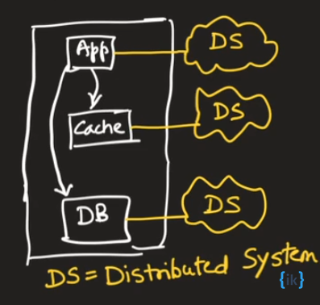
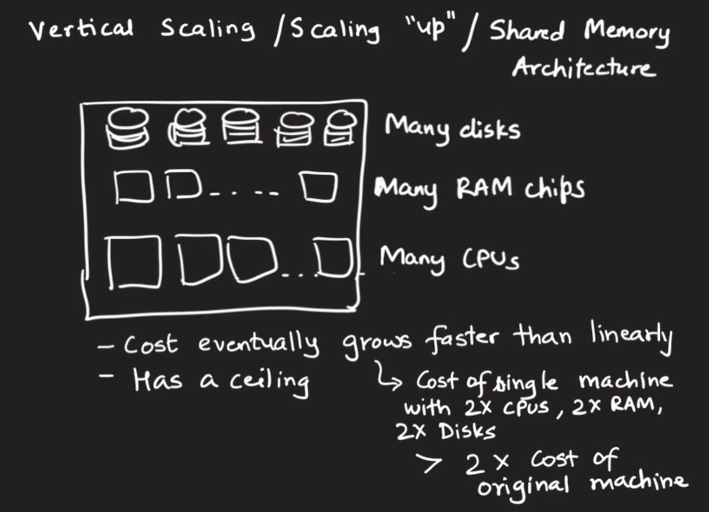
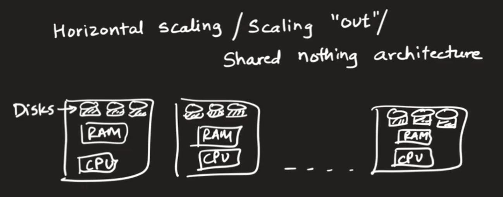

## First steps:

1. Gather functional requirements.
1. Cluster them into a collection of microservices
1. Draw the architecture diagram connecting them.
1. Dive into each microservice. For each: 
    1. assuming scale is not in picture
    1. Gather non-functional/capacity requirements and check whether and how to scale each tier
    1. propose a distributed system for each tier.

The following is a general representation of microservice architecture:

## Reasons we may want to go for a distributed system:

1. Check how much data needs to be stored : may need to scale DB and cache tier if size of the data is too huge.
1. If the number of requests per second is too huge, need to scale for throughput 
1. If the response time is too high, need to parallelize the computation
1. Availability / Reliability in the face of faults 
1. Geolocation : Minimize network latency by using multiple servers at different locations. 
1. Hotspots: Disproportionately high load on a piece of data

Instead of going for distributed system, an easier alternative would be vertical scaling:

In contrast, horizontal scaling looks like this:

